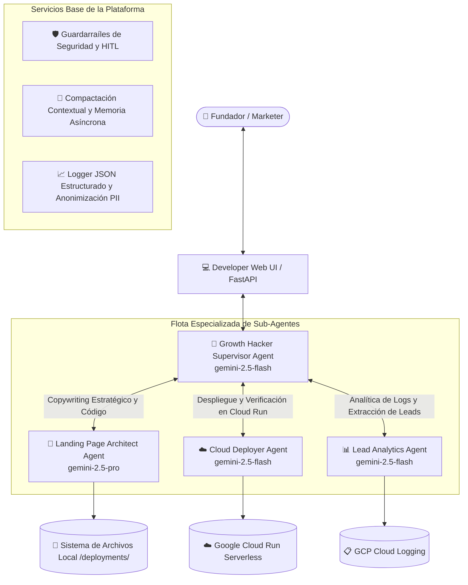

# 🚀 ADK Growth Hacker Agent: Plataforma Multi-Agente Serverless para Páginas de Aterrizaje

| [🇺🇸 English](README.md) | 🇪🇸 **Español** | [🇧🇷 Português (Brasil)](README.pt-br.md) |
| :---: | :---: | :---: |

¡Bienvenido a la plataforma **ADK Growth Hacker Agent**! Un sistema autónomo multi-agente de nivel empresarial construido sobre el **Google Agent Development Kit (ADK)**. Diseñado para ayudar a fundadores de startups, profesionales de marketing y desarrolladores a validar ideas de negocio instantáneamente mediante páginas de aterrizaje pre-lanzamiento de ultra-alta conversión, contenerizarlas y desplegarlas en **Google Cloud Run** en minutos.

El sistema orquesta una flota especializada de sub-agentes con enrutamiento inteligente de modelos (**Gemini 2.5 Pro** para síntesis creativa de código y **Gemini 2.5 Flash** para tareas operativas rápidas), guardarraíles de seguridad, compactación de memoria contextual, observabilidad JSON estructurada e **Infraestructura como Código (IaC) con Terraform**.

---

## 📐 Arquitectura Multi-Agente y Flujo del Sistema

La plataforma implementa un patrón **Supervisor-Trabajador Multi-Agente** con trazabilidad distribuida y enrutamiento estratégico:



---

## ✨ Capacidades Clave del Sistema Multi-Agente

### 1. 🤖 Supervisor y Sub-Agentes Especializados
* **Growth Hacker Supervisor (`gemini-2.5-flash`):** Coordina las intenciones del usuario, gestiona el flujo conversacional, aplica guardarraíles y solicita autorizaciones Human-in-the-Loop.
* **🎨 Landing Page Architect (`gemini-2.5-pro`):** Utiliza razonamiento profundo para formular Briefs de Conversión en español (ganchos H1, marco AIDA, canales de adquisición) y genera código responsivo HTML/CSS/JS y backends FastAPI.
* **☁️ Cloud Deployer Agent (`gemini-2.5-flash`):** Gestiona el empaquetado en Cloud Storage, compilación en Cloud Build, despliegue en Cloud Run y verificación de endpoints activos.
* **📊 Lead Analytics Agent (`gemini-2.5-flash`):** Consulta Cloud Logging, extrae leads de lista de espera y calcula métricas de conversión con anonimización PII.

### 2. 🛡️ Guardarraíles de Seguridad y Human-in-the-Loop (HITL)
* **Validación de Seguridad:** Bloquea programáticamente inyecciones de prompt y comandos no autorizados.
* **Comprobación HITL:** Exige confirmación explícita del usuario antes de ejecutar despliegues en Google Cloud Run.

### 3. 🧠 Compactación de Contexto y Memoria Asíncrona
* **Compactador de Tokens:** Trunca y sintetiza turnos conversacionales antiguos cuando el contexto supera los 4.000 tokens.
* **Consolidación Asíncrona:** Ejecuta tareas de fondo (`asyncio.create_task`) para extraer hechos clave del producto en almacenamiento persistente.

### 4. 📈 Observabilidad Empresarial y Anonimización PII
* **Logs JSON Estructurados:** Genera eventos JSON legibles por máquina con `timestamp`, `trace_id`, `span_id`, `agent_name`, `intent` y `outcome`.
* **Redacción Automática de PII:** Enmascara correos (`j***e@dominio.com`) y tokens Bearer/OAuth antes de escribir en los logs.
* **Trazabilidad Distribuida:** Context managers `TraceSpan` compatibles con Google Cloud Trace y OpenTelemetry.

### 5. 🏗️ Infraestructura como Código (Terraform)
* Manifiestos declarativos de Terraform ([main.tf](file:///Users/andresvilla/Development/Projects/2026/ADK/adk_landing/main.tf), [variables.tf](file:///Users/andresvilla/Development/Projects/2026/ADK/adk_landing/variables.tf), [outputs.tf](file:///Users/andresvilla/Development/Projects/2026/ADK/adk_landing/outputs.tf), [terraform/](file:///Users/andresvilla/Development/Projects/2026/ADK/adk_landing/terraform), e [infra/](file:///Users/andresvilla/Development/Projects/2026/ADK/adk_landing/infra)) para gestionar Cloud Run, IAM y cuentas de servicio.

---

## 🚀 Inicio Rápido

```bash
# Activar entorno virtual e instalar dependencias
source .venv/bin/activate
pip install -r requirements.txt

# Ejecutar la suite completa de pruebas y el arnés del Golden Dataset
python -m unittest discover tests
python -m eval.eval_harness

# Iniciar la interfaz web del desarrollador
python main.py
```
Accede desde tu navegador a **`http://localhost:8080/`**.
