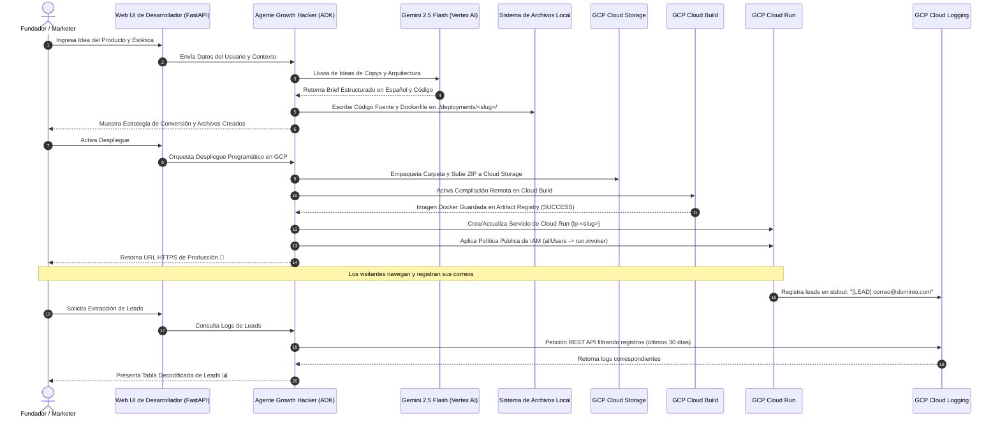

# 🚀 Agente ADK Growth Hacker: Plataforma de Páginas de Aterrizaje Serverless

| [🇺🇸 English](README.md) | 🇪🇸 **Español** | [🇧🇷 Português (Brasil)](README.pt-br.md) |
| :---: | :---: | :---: |

¡Bienvenido a la **Plataforma de Agente Growth Hacker de ADK**! Este es un sistema agentico autónomo y avanzado construido sobre el **Kit de Desarrollo de Agentes de Google (ADK)**. Está diseñado para ayudar a fundadores, marketers y desarrolladores a validar instantáneamente nuevas ideas de productos generando páginas de aterrizaje pre-lanzamiento premium, contenedorizándolas y desplegándolas de manera serverless en **Google Cloud Run** en minutos.

A través de la interacción en lenguaje natural, el agente elabora estrategias de ganchos de redacción, establece guías de adquisición y automatiza todas las tareas de ingeniería en Google Cloud, incluyendo el almacenamiento temporal en Cloud Storage, compilación en Cloud Build, aprovisionamiento en Cloud Run, exposición pública de IAM y extracción de leads en tiempo real desde Cloud Logging.

---

## 📐 Arquitectura y Flujo del Sistema

La plataforma utiliza una arquitectura híbrida local y en la nube. A continuación se muestra la arquitectura de alto nivel y el flujo de trabajo estructurado:




---

## ✨ Características Clave

- **Estrategia de Conversión Briefing:** Genera briefs estructurados con ganchos en la sección Hero, guías de copia alineadas con AIDA, playbooks de adquisición orgánica y marcos métricos de KPIs.
- **Diseño UI/UX Premium:** Plantillas HTML/CSS/JS completamente responsivas para dispositivos móviles, utilizando paletas de colores modernas, efectos de resplandor, tipografía de Google Fonts y micro-animaciones.
- **Servidor Backend FastAPI Completo:** Cada landing page generada incluye:
  - Enrutadores y controladores AJAX para envíos asíncronos.
  - Limitador de tasa por IP de cliente (máximo 5 envíos por minuto) para evitar spam.
  - Registros limpios a `stdout` formateados como `[LEAD] correo@dominio.com` para ingesta inmediata en la nube.
- **Despliegue en la Nube sin Fricción:** Utiliza librerías REST de GCP para subir, construir y desplegar sin necesidad de tener instalado localmente Docker o la CLI de gcloud.
- **Extracción Serverless de Leads:** Descarta bases de datos tradicionales consultando directamente la API de **Cloud Logging** mediante paginación, filtrado y expresiones regulares.

---

## 🗂️ Estructura del Repositorio

```bash
adk_landing/
├── .adk/                        # Contexto de configuración de Google ADK
├── .venv/                       # Entorno virtual de Python local
├── deployments/                 # Caché local de proyectos generados
│   └── <slug>/                  # Proyecto individual generado
│       ├── static/              
│       │   ├── index.html       # Landing page estática indexada
│       │   ├── style.css        # Hoja de estilos premium personalizada
│       │   └── script.js        # Lógica frontend del formulario de leads
│       ├── main.py              # Servidor FastAPI con limitador de tasa
│       ├── requirements.txt     # Dependencias del microservicio
│       └── Dockerfile           # Contenedor Docker ligero
├── growth_hacker_agent/         # Lógica del Agente de Growth Hacking
│   ├── __init__.py
│   └── agent.py                 # Clase de Agente ADK, herramientas y prompts del sistema
├── main.py                      # Servidor local de FastAPI y panel web de control
├── requirements.txt             # Dependencias del entorno global
└── sessions.db                  # Base de datos SQLite para historiales de chat
```

---

## 🚀 Guía de Inicio Rápido

### 1. Requisitos Previos y Autenticación en GCP

La aplicación resuelve las credenciales en el siguiente orden: variables de entorno -> Servidor de Metadatos de GCP -> tokens OAuth locales.

Antes de iniciar, asegúrate de tener:
- Un proyecto de Google Cloud activo.
- La herramienta [gcloud CLI](https://cloud.google.com/sdk/gcloud) instalada.

Autentica tu terminal local usando **Application Default Credentials (ADC)**:
```bash
# Inicia sesión con tu cuenta de Google
gcloud auth login

# Configura tu proyecto por defecto
gcloud config set project TU_ID_PROYECTO_GCP

# Genera las credenciales predeterminadas de la aplicación
gcloud auth application-default login
```

### 2. Configuración de Entorno

Clona el repositorio, crea tu entorno virtual e instala las librerías requeridas:
```bash
# Entra al directorio raíz
cd adk_landing/

# Crea y activa el entorno virtual
python3 -m venv .venv
source .venv/bin/activate

# Instala las dependencias
pip install -r requirements.txt
```

### 3. Ejecución de la Interfaz Web

Inicia el servidor FastAPI de desarrollo local:
```bash
python main.py
```
El servidor iniciará en el puerto `8080`. Abre tu navegador e ingresa a:
👉 **`http://localhost:8080/`**

---

## 🛠️ Flujo de Trabajo de Ejemplo con el Agente

El agente está configurado con un **Enforzador de Idioma Español** que redactará todos los textos de marketing exclusivamente en español.

### Fase 1: Diseño del Proyecto
1. **Inicia el chat:** Escribe algo como:
   > *"¡Hola! Quiero validar una idea de negocio de un termo inteligente llamado 'SmartBrew Kettle'."*
2. **Detalla los requerimientos:** El agente te preguntará sobre características, público objetivo y el tema estético deseado (ej. *Modo oscuro Glassmorphic con acentos verde neón*).
3. **Generación de archivos:** El agente llama automáticamente a `write_landing_page_files` y los almacena en `./deployments/smartbrew-kettle/`.

### Fase 2: Despliegue Serverless
1. **Autoriza al Agente:** Cuando te pregunte si deseas desplegar en vivo, dile:
   > *"Sí, despliega el proyecto."*
2. **Despliegue:** El agente sube el empaquetado, compila la imagen de Docker en Cloud Build, despliega en Cloud Run y configura las políticas públicas de IAM para entregarte tu URL:
   > **`https://lp-smartbrew-kettle-xxxxxx.run.app`**

### Fase 3: Consulta de Leads
Para extraer los correos recolectados en tu lista de espera:
1. Escribe al agente:
   > *"Muéstrame los correos registrados para smartbrew-kettle"*
2. El agente consulta Cloud Logging mediante la API y te muestra la tabla de correos.

---

## 🔐 Permisos y Roles de IAM en GCP

Tu cuenta activa o cuenta de servicio de GCP requiere los siguientes permisos para ejecutar las tareas de la plataforma:

| Servicio | Rol de IAM Requerido | Propósito |
| :--- | :--- | :--- |
| **Google Cloud Storage** | `roles/storage.objectAdmin` | Subir paquetes fuente ZIP a los buckets de almacenamiento. |
| **Cloud Build** | `roles/cloudbuild.builds.editor` | Ejecutar compilaciones de imágenes y subirlas a Artifact Registry. |
| **Cloud Run** | `roles/run.admin` | Crear, parchar y configurar servicios de Cloud Run. |
| **Cuentas de Servicio** | `roles/iam.serviceAccountUser` | Correr el contenedor bajo el contexto del Compute Engine predeterminado. |
| **Cloud Logging** | `roles/logging.viewer` | Consultar logs en tiempo real para capturar leads (`[LEAD] ...`). |
| **Project IAM / Run Policy** | `roles/run.developer` o `roles/resourcemanager.projectIamAdmin` | Aplicar políticas de acceso público sin autenticar (`allUsers`). |
