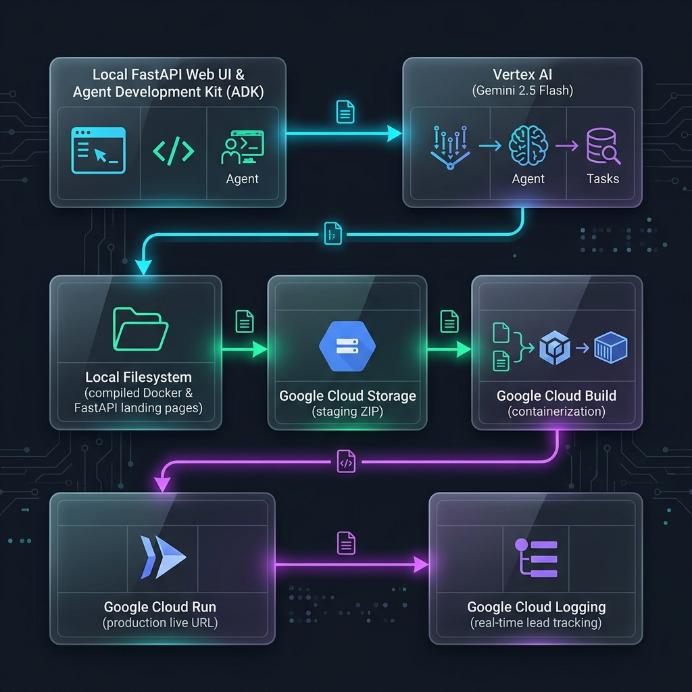
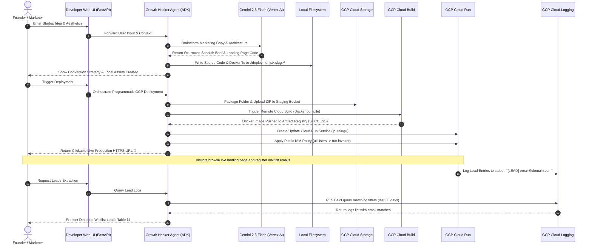

# 🚀 ADK Growth Hacker Agent: Serverless Landing Page Platform

| 🇺🇸 **English** | [🇪🇸 Español](README.es.md) | [🇧🇷 Português (Brasil)](README.pt-br.md) |
| :---: | :---: | :---: |

Welcome to the **ADK Growth Hacker Agent Platform**! This is an advanced, autonomous Agentic system built on top of the **Google Agent Development Kit (ADK)**. It is designed to help startup founders, marketers, and developers instantly validate new product ideas by generating ultra-premium, high-converting pre-release landing pages, containerizing them, and deploying them serverlessly to **Google Cloud Run** in minutes.

Through natural language interaction, the agent strategizes copywriting hooks, establishes acquisition playbooks, and automates all GCP cloud engineering tasks—including Cloud Storage staging, Cloud Build compilation, Cloud Run provisioning, public IAM exposure, and real-time lead extraction from Cloud Logging.

---

## 📐 Architecture & System Flow

The platform utilizes a hybrid local-and-cloud architecture. Below is the high-level architecture and structural workflow showing how the ADK FastAPI runtime orchestrates the Growth Hacker Agent and interfaces with Google Cloud services:





---

## ✨ Key Features

- **Conversion-First Marketing Strategy:** Generates structured Conversion Briefs including highly persuasive Hero Hooks, AIDA-aligned copy blueprints, organic launch playbooks, and key KPI measurement frameworks.
- **Stunning UI/UX Design (CSS System):** Builds fully mobile-responsive HTML/CSS/JS templates utilizing curated theme color palettes, glowing box shadows, clean modern typography (via Google Fonts), and micro-animations.
- **Robust Backend Boilerplate:** Every generated landing page is created as a standalone FastAPI microservice complete with:
  - Client-side AJAX lead submission handlers.
  - In-memory client-IP rate limiting (max 5 submissions/min) to prevent server abuse.
  - Server-side logging capturing leads directly to `stdout` as `[LEAD] email@domain.com` for serverless ingestion.
  - Local JSON container backups.
- **Zero-Configuration Cloud Deployment:** Programs standard GCP client libraries asynchronously to zip, stage, compile, and deploy without requiring local Docker, local gcloud installations, or pre-compiled packages.
- **Serverless Leads Retrieval:** Eliminates databases by querying **Cloud Logging** API records using pagination, filtering, and regex capturing to dynamically aggregate waitlist lead sign-ups instantly.

---

## 🗂️ Repository Structure

```bash
adk_landing/
├── .adk/                        # Google ADK configuration context
├── .venv/                       # Local python virtual environment
├── deployments/                 # Local cache of generated projects
│   └── <slug>/                  # Individual generated landing page project
│       ├── static/              
│       │   ├── index.html       # Generated HTML5 waitlist landing page
│       │   ├── style.css        # Curated custom CSS styling sheet
│       │   └── script.js        # Client-side waitlist form handler
│       ├── main.py              # FastAPI backend with rate limiting
│       ├── requirements.txt     # Microservice backend dependencies
│       └── Dockerfile           # Slim Python container definition
├── growth_hacker_agent/         # Growth Hacker Agent logic
│   ├── __init__.py
│   └── agent.py                 # Core ADK Agent class, custom tools, & system prompt
├── main.py                      # Root FastAPI application hosting local web UI/API
├── requirements.txt             # Global runtime package dependencies
└── sessions.db                  # Persistent chat SQLite database
```

---

## 🚀 Quick Start

### 1. Prerequisites & GCP Authentication

The application resolves authentication contexts automatically in the following sequence: env vars -> GCP Metadata Server -> active User OAuth tokens.

Before starting, ensure you have:
- A Google Cloud Project.
- The [gcloud CLI](https://cloud.google.com/sdk/gcloud) installed and initialized.

Authenticate your local terminal using **Application Default Credentials (ADC)**:
```bash
# Authenticate your user account
gcloud auth login

# Set the active project
gcloud config set project YOUR_GCP_PROJECT_ID

# Generate application default credentials (critical for library auth)
gcloud auth application-default login
```

### 2. Environment Setup

Clone the repository, create a virtual environment, and install dependencies:
```bash
# Navigate to project root
cd adk_landing/

# Create virtual environment
python3 -m venv .venv
source .venv/bin/activate

# Install required packages
pip install -r requirements.txt
```

### 3. Launching the Platform Web UI

Run the local developer app server:
```bash
python main.py
```
By default, this boots the server on port `8080`. Open your browser and navigate to:
👉 **`http://localhost:8080/`**

You can now interact directly with the **Growth Hacker Agent** using the interactive chat console to design landing pages and trigger deployments!

---

## 🛠️ How to Interact with the Agent (Example Flow)

The agent is programmed with a strict **Spanish Conversational Enforcer** to deliver high-converting copy tailored to Spanish-speaking markets.

### Phase 1: Designing the Landing Page
1. **Initiate the chat:** Send a message like:
   > *"Hola! Quiero lanzar un dry-run para validar un termo inteligente que calienta el agua a la temperatura exacta según el tipo de té: 'SmartBrew Kettle'."*
2. **Answer strategic questions:** The agent will ask you to define the feature set, target personas, CTA wording, and desired aesthetic theme (e.g., *Glassmorphism dark mode with neon emerald accents*).
3. **Strategy brief:** The agent compiles a comprehensive strategic playbook and code structure.
4. **File Generation:** The agent calls `write_landing_page_files` automatically to compile the code assets and caches them inside the `./deployments/smartbrew-kettle/` directory.

### Phase 2: Serverless Live Deployment
1. **Authorize Deployment:** The agent will ask:
   > *¿Quieres que despliegue esta página de aterrizaje en vivo en Google Cloud Run?*
2. Respond with:
   > *"Sí, por favor despliega el proyecto."*
3. **Autopilot:** The agent triggers `deploy_landing_page`. It dynamically uploads the source package to Cloud Storage, starts a build execution, deploys the revision container, configures a public access policy, and serves the resulting URL:
   > **`https://lp-smartbrew-kettle-xxxxxx.run.app`**

### Phase 3: Lead Extraction
After driving test traffic to the landing page, collect waitlist sign-ups directly from the agent:
1. Ask the agent:
   > *"Muéstrame los correos registrados para el proyecto smartbrew-kettle"* (or *"pull signups for smartbrew-kettle"*).
2. The agent triggers `fetch_waitlist_emails`, aggregates Cloud Logging records, and displays a clean tabular list of all gathered emails.

---

## 🔐 Required GCP Permissions & IAM Roles

To perform the automated deployment and lead retrieval successfully, the active GCP identity (the user account logged into `gcloud` or a dedicated service account) requires the following roles inside the destination GCP Project:

| Service | Required IAM Role | Rationale |
| :--- | :--- | :--- |
| **Google Cloud Storage** | `roles/storage.objectAdmin` | Required to stage source code ZIP bundles inside GCS bundles. |
| **Cloud Build** | `roles/cloudbuild.builds.editor` | Required to trigger remote builds and push images to Artifact Registry. |
| **Cloud Run** | `roles/run.admin` | Required to create, update, patch, and configure Cloud Run service deployments. |
| **Service Accounts** | `roles/iam.serviceAccountUser` | Required to run Cloud Run containers under the default Compute Engine service account context. |
| **Cloud Logging** | `roles/logging.viewer` | Required to query waitlist stdout lead registers (`[LEAD] ...`) from logs. |
| **Project IAM / Run Policy** | `roles/run.developer` or `roles/resourcemanager.projectIamAdmin` | Required to modify the IAM policy on Cloud Run services to grant public Access (`allUsers` invoker). |

---

## 🧪 Automated Testing & Golden Dataset Evaluation

The platform includes an automated testing harness that benchmarks the Growth Hacker Agent against a curated **Golden Dataset** (`eval/golden_dataset.json`):

```bash
# Execute the full Golden Dataset Evaluation Harness
python -m eval.eval_harness

# Or run all unit and evaluation tests with Python unittest
python -m unittest discover tests
```

---

## 🏗️ Infrastructure as Code (Terraform)

In addition to dynamic programmatic deployments, production infrastructure can be provisioned declaratively via **Terraform**:

```bash
cd terraform/

# Initialize Terraform providers
terraform init

# Review execution plan
terraform plan

# Apply infrastructure changes
terraform apply
```

