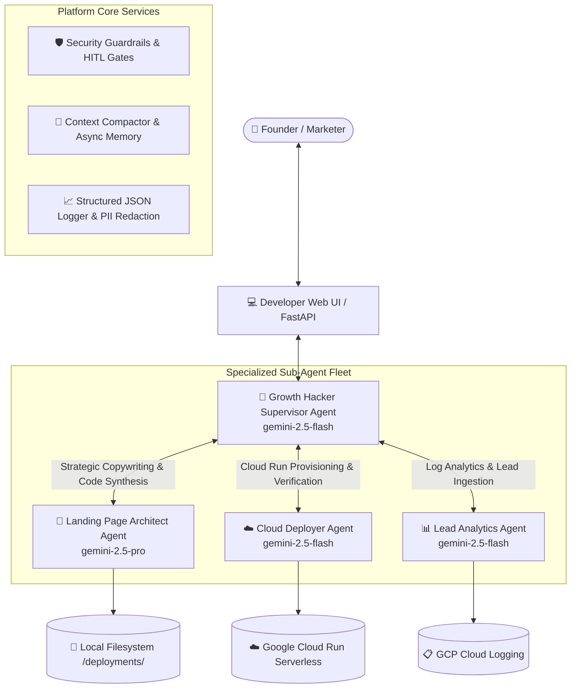

# 🚀 ADK Growth Hacker Agent: Serverless Landing Page Platform

| 🇺🇸 **English** | [🇪🇸 Español](README.es.md) | [🇧🇷 Português (Brasil)](README.pt-br.md) |
| :---: | :---: | :---: |

Welcome to the **ADK Growth Hacker Agent Platform**! This is an enterprise-grade, autonomous multi-agent system built on top of the **Google Agent Development Kit (ADK)**. It is designed to help startup founders, marketers, and developers instantly validate new product ideas by generating ultra-premium, high-converting pre-release landing pages, containerizing them, and deploying them serverlessly to **Google Cloud Run** in minutes.

The platform orchestrates a specialized team of autonomous sub-agents with strategic model routing (**Gemini 2.5 Pro** for creative synthesis & **Gemini 2.5 Flash** for rapid operational tasks), programmatic security guardrails, token-aware context compaction, structured JSON observability, and declarative **Terraform Infrastructure as Code (IaC)**.

---

## 📐 Multi-Agent Architecture & System Flow

The platform utilizes a **Supervisor-Worker Multi-Agent Architecture** with strategic LLM routing and distributed tracing:



---

## ✨ Core Multi-Agent Capabilities

### 1. 🤖 Supervisor & Specialized Sub-Agents
* **Growth Hacker Supervisor (`gemini-2.5-flash`):** Coordinates user intent, manages conversational flow, enforces security guardrails, and handles Human-in-the-Loop authorization.
* **🎨 Landing Page Architect (`gemini-2.5-pro`):** Uses deep reasoning to formulate Spanish Conversion Strategy Briefs (H1 hooks, AIDA frameworks, organic launch playbooks) and synthesizes responsive HTML/CSS/JS and FastAPI container code.
* **☁️ Cloud Deployer Agent (`gemini-2.5-flash`):** Manages Google Cloud Storage staging, remote Cloud Build compilation, Cloud Run provisioning, and live endpoint verification.
* **📊 Lead Analytics Agent (`gemini-2.5-flash`):** Queries Cloud Logging API records, aggregates waitlist signups, and computes conversion metrics with automated PII masking.

### 2. 🛡️ Security Guardrails & Human-in-the-Loop (HITL)
* **Input Security Guardrails:** Programmatically intercepts and blocks prompt injections, jailbreaks, and unauthorized system override commands.
* **Code-Level HITL Confirmation:** Enforces explicit user confirmation gates before triggering high-impact actions like Google Cloud Run deployments.

### 3. 🧠 Context Compaction & Async Long-Term Memory
* **Sliding-Window Token Compactor:** Automatically truncates older conversational dialogue and generates structured summaries when context exceeds 4,000 tokens.
* **Async Memory Consolidation:** Spawns non-blocking background async tasks (`asyncio.create_task`) that extract product facts and live deployment URLs into persistent storage.

### 4. 📈 Enterprise Observability & PII Redaction
* **Structured JSON Logging:** Outputs machine-readable JSON log events with `timestamp`, `trace_id`, `span_id`, `agent_name`, `intent`, and `outcome`.
* **Automated PII Masking:** Automatically sanitizes email addresses (`j***e@domain.com`) and Bearer/OAuth tokens before logging.
* **Distributed Tracing Spans:** Generates W3C-compatible `TraceSpan` context managers for tracking latency and execution performance.

### 5. 🏗️ Declarative Infrastructure as Code (Terraform)
* Complete declarative Terraform configurations ([main.tf](file:///Users/andresvilla/Development/Projects/2026/ADK/adk_landing/main.tf), [variables.tf](file:///Users/andresvilla/Development/Projects/2026/ADK/adk_landing/variables.tf), [outputs.tf](file:///Users/andresvilla/Development/Projects/2026/ADK/adk_landing/outputs.tf), [terraform/](file:///Users/andresvilla/Development/Projects/2026/ADK/adk_landing/terraform), and [infra/](file:///Users/andresvilla/Development/Projects/2026/ADK/adk_landing/infra)) to manage Cloud Run services, IAM bindings, and dedicated Service Accounts declaratively.

---

## 🗂️ Repository Structure

```bash
adk_landing/
├── .github/workflows/ci.yml     # Automated CI/CD pipeline & eval harness runner
├── eval/                        # Golden Dataset Evaluation suite
│   ├── eval_harness.py          # Automated evaluation runner (100% benchmark score)
│   └── golden_dataset.json      # Curated golden benchmark test cases
├── growth_hacker_agent/         # Core ADK Agent & Sub-Agent implementations
│   ├── agent.py                 # Supervisor Agent, Sub-Agents, & tool functions
│   ├── guardrails.py            # Security guardrails & Human-in-the-Loop (HITL) gate
│   ├── memory.py                # History compactor & async memory consolidation
│   ├── observability.py         # Structured JSON logger, PII redaction, & TraceSpan
│   └── schemas.py               # Strict Pydantic v2 validation models & schemas
├── deployments/                 # Generated landing page project folders & IaC manifests
├── terraform/                   # Standalone Terraform Infrastructure as Code module
├── infra/                       # Additional declarative infrastructure manifests
├── tests/                       # Complete pytest/unittest automated test suite
├── main.tf                      # Root Terraform Cloud Run service configuration
├── variables.tf                 # Root Terraform variables definition
├── outputs.tf                   # Root Terraform output definitions
├── main.py                      # Root FastAPI application hosting web UI
└── requirements.txt             # Global runtime package dependencies
```

---

## 🚀 Quick Start

### 1. Environment Setup
```bash
# Clone the repository
git clone https://github.com/AllInVaders/adk_landing.git
cd adk_landing/

# Create and activate virtual environment
python3 -m venv .venv
source .venv/bin/activate

# Install dependencies
pip install -r requirements.txt
```

### 2. Run Automated Tests & Golden Dataset Evaluation
```bash
# Run the complete test suite (18/18 passing)
python -m unittest discover tests

# Execute the Golden Dataset Evaluation Harness
python -m eval.eval_harness
```

### 3. Launch the Developer Web UI
```bash
python main.py
```
Open your browser at **`http://localhost:8080/`** to interact with the multi-agent team!

---

## 🏗️ Declarative Infrastructure as Code (Terraform)

Deploy production Cloud Run resources declaratively using Terraform:

```bash
# Initialize Terraform
terraform init

# Review execution plan
terraform plan

# Apply infrastructure changes
terraform apply
```
