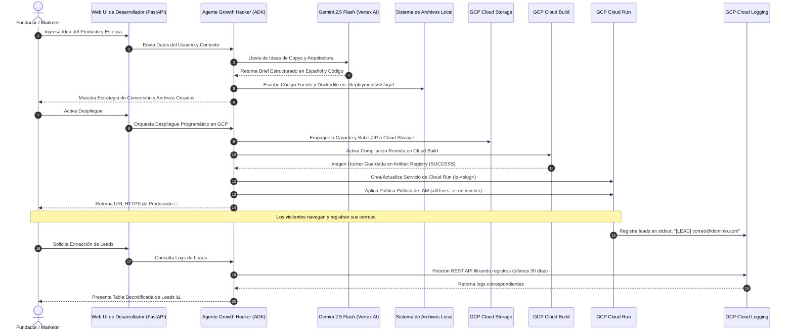
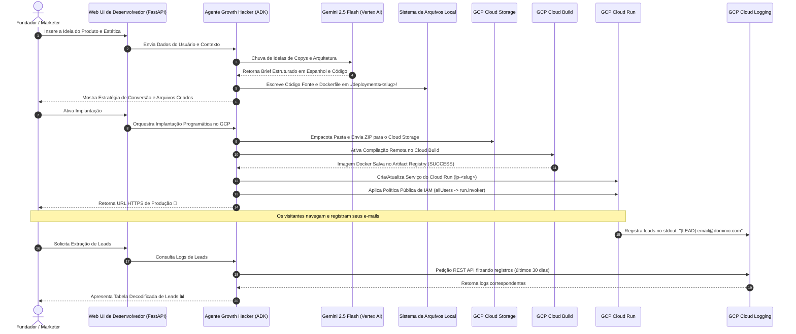
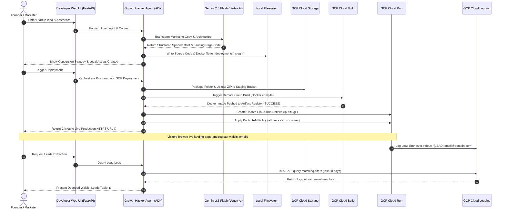

# 🚀 ADK Growth Hacker Agent: Serverless Landing Page Platform

Select your preferred language / Selecciona tu idioma / Selecione o seu idioma:

* [🇪🇸 Español](#-español)
* [🇵🇹 Português](#-português)
* [🇬🇧 English](#-english)

---

## 🇪🇸 Español

<details>
<summary><b>👉 Haz clic para desplegar el README en Español</b></summary>

# 🚀 Agente ADK Growth Hacker: Plataforma de Páginas de Aterrizaje Serverless

¡Bienvenido a la **Plataforma de Agente Growth Hacker de ADK**! Este es un sistema agentico autónomo y avanzado construido sobre el **Kit de Desarrollo de Agentes de Google (ADK)**. Está diseñado para ayudar a fundadores, marketers y desarrolladores a validar instantáneamente nuevas ideas de productos generando páginas de aterrizaje pre-lanzamiento premium, contenedorizándolas y desplegándolas de manera serverless en **Google Cloud Run** en minutos.

A través de la interacción en lenguaje natural, el agente elabora estrategias de ganchos de redacción, establece guías de adquisición y automatiza todas las tareas de ingeniería en Google Cloud, incluyendo el almacenamiento temporal en Cloud Storage, compilación en Cloud Build, aprovisionamiento en Cloud Run, exposición pública de IAM y extracción de leads en tiempo real desde Cloud Logging.

---

### 📐 Arquitectura y Flujo del Sistema

La plataforma utiliza una arquitectura híbrida local y en la nube. A continuación se muestra la arquitectura de alto nivel y el flujo de trabajo estructurado:




---

### ✨ Características Clave

- **Estrategia de Conversión Briefing:** Genera briefs estructurados con ganchos en la sección Hero, guías de copia alineadas con AIDA, playbooks de adquisición orgánica y marcos métricos de KPIs.
- **Diseño UI/UX Premium:** Plantillas HTML/CSS/JS completamente responsivas para dispositivos móviles, utilizando paletas de colores modernas, efectos de resplandor, tipografía de Google Fonts y micro-animaciones.
- **Servidor Backend FastAPI Completo:** Cada landing page generada incluye:
  - Enrutadores y controladores AJAX para envíos asíncronos.
  - Limitador de tasa por IP de cliente (máximo 5 envíos por minuto) para evitar spam.
  - Registros limpios a `stdout` formateados como `[LEAD] correo@dominio.com` para ingesta inmediata en la nube.
- **Despliegue en la Nube sin Fricción:** Utiliza librerías REST de GCP para subir, construir y desplegar sin necesidad de tener instalado localmente Docker o la CLI de gcloud.
- **Extracción Serverless de Leads:** Descarta bases de datos tradicionales consultando directamente la API de **Cloud Logging** mediante paginación, filtrado y expresiones regulares.

---

### 🗂️ Estructura del Repositorio

```bash
adk_landing/
├── .adk/                        # Contexto de configuración de Google ADK
├── .venv/                       # Entorno virtual de Python local
├── deployments/                 # Caché local de proyectos generados
│   └── <slug>/                  # Proyecto individual generado
│       ├── static/              
│       │   ├── index.html       # Landing page estática indexada
│       │   ├── style.css        # Hoja de estilos premium personalizada
│       │   └── script.js        # Lógica frontend del formulario de leads
│       ├── main.py              # Servidor FastAPI con limitador de tasa
│       ├── requirements.txt     # Dependencias del microservicio
│       └── Dockerfile           # Contenedor Docker ligero
├── growth_hacker_agent/         # Lógica del Agente de Growth Hacking
│   ├── __init__.py
│   └── agent.py                 # Clase de Agente ADK, herramientas y prompts del sistema
├── main.py                      # Servidor local de FastAPI y panel web de control
├── requirements.txt             # Dependencias del entorno global
└── sessions.db                  # Base de datos SQLite para historiales de chat
```

---

### 🚀 Guía de Inicio Rápido

#### 1. Requisitos Previos y Autenticación en GCP

La aplicación resuelve las credenciales en el siguiente orden: variables de entorno -> Servidor de Metadatos de GCP -> tokens OAuth locales.

Antes de iniciar, asegúrate de tener:
- Un proyecto de Google Cloud activo.
- La herramienta [gcloud CLI](https://cloud.google.com/sdk/gcloud) instalada.

Autentica tu terminal local usando **Application Default Credentials (ADC)**:
```bash
# Inicia sesión con tu cuenta de Google
gcloud auth login

# Configura tu proyecto por defecto
gcloud config set project TU_ID_PROYECTO_GCP

# Genera las credenciales predeterminadas de la aplicación
gcloud auth application-default login
```

#### 2. Configuración de Entorno

Clona el repositorio, crea tu entorno virtual e instala las librerías requeridas:
```bash
# Entra al directorio raíz
cd adk_landing/

# Crea y activa el entorno virtual
python3 -m venv .venv
source .venv/bin/activate

# Instala las dependencias
pip install -r requirements.txt
```

#### 3. Ejecución de la Interfaz Web

Inicia el servidor FastAPI de desarrollo local:
```bash
python main.py
```
El servidor iniciará en el puerto `8080`. Abre tu navegador e ingresa a:
👉 **`http://localhost:8080/`**

---

### 🛠️ Flujo de Trabajo de Ejemplo con el Agente

El agente está configurado con un **Enforzador de Idioma Español** que redactará todos los textos de marketing exclusivamente en español.

#### Fase 1: Diseño del Proyecto
1. **Inicia el chat:** Escribe algo como:
   > *"¡Hola! Quiero validar una idea de negocio de un termo inteligente llamado 'SmartBrew Kettle'."*
2. **Detalla los requerimientos:** El agente te preguntará sobre características, público objetivo y el tema estético deseado (ej. *Modo oscuro Glassmorphic con acentos verde neón*).
3. **Generación de archivos:** El agente llama automáticamente a `write_landing_page_files` y los almacena en `./deployments/smartbrew-kettle/`.

#### Fase 2: Despliegue Serverless
1. **Autoriza al Agente:** Cuando te pregunte si deseas desplegar en vivo, dile:
   > *"Sí, despliega el proyecto."*
2. **Despliegue:** El agente sube el empaquetado, compila la imagen de Docker en Cloud Build, despliega en Cloud Run y configura las políticas públicas de IAM para entregarte tu URL:
   > **`https://lp-smartbrew-kettle-xxxxxx.run.app`**

#### Fase 3: Consulta de Leads
Para extraer los correos recolectados en tu lista de espera:
1. Escribe al agente:
   > *"Muéstrame los correos registrados para smartbrew-kettle"*
2. El agente consulta Cloud Logging mediante la API y te muestra la tabla de correos.

---

### 🔐 Permisos y Roles de IAM en GCP

Tu cuenta activa o cuenta de servicio de GCP requiere los siguientes permisos para ejecutar las tareas de la plataforma:

| Servicio | Rol de IAM Requerido | Propósito |
| :--- | :--- | :--- |
| **Google Cloud Storage** | `roles/storage.objectAdmin` | Subir paquetes fuente ZIP a los buckets de almacenamiento. |
| **Cloud Build** | `roles/cloudbuild.builds.editor` | Ejecutar compilaciones de imágenes y subirlas a Artifact Registry. |
| **Cloud Run** | `roles/run.admin` | Crear, parchar y configurar servicios de Cloud Run. |
| **Cuentas de Servicio** | `roles/iam.serviceAccountUser` | Correr el contenedor bajo el contexto del Compute Engine predeterminado. |
| **Cloud Logging** | `roles/logging.viewer` | Consultar logs en tiempo real para capturar leads (`[LEAD] ...`). |
| **Project IAM / Run Policy** | `roles/run.developer` o `roles/resourcemanager.projectIamAdmin` | Aplicar políticas de acceso público sin autenticar (`allUsers`). |

</details>

---

## 🇵🇹 Português

<details>
<summary><b>👉 Clique para expandir o README em Português</b></summary>

# 🚀 Agente ADK Growth Hacker: Plataforma de Landing Pages Serverless

Bem-vindo à **Plataforma do Agente Growth Hacker de ADK**! Este é um sistema agentico autônomo e avançado construído sobre o **Kit de Desenvolvimento de Agentes do Google (ADK)**. Ele foi projetado para ajudar fundadores, profissionais de marketing e desenvolvedores a validar instantaneamente novas ideias de produtos, gerando landing pages de pré-lançamento premium, conteinerizando-as e implantando-as de maneira serverless no **Google Cloud Run** em minutos.

Por meio da interação em linguagem natural, o agente elabora estratégias de ganchos de redação, estabelece guias de aquisição e automatiza todas as tarefas de engenharia no Google Cloud, incluindo armazenamento temporário no Cloud Storage, compilação no Cloud Build, provisionamento no Cloud Run, exposição pública do IAM e extração de leads em tempo real do Cloud Logging.

---

### 📐 Arquitetura e Fluxo do Sistema

A plataforma utiliza uma arquitetura híbrida local e em nuvem. A seguir, apresentamos a arquitetura de alto nível e o fluxo de trabalho estruturado:




---

### ✨ Recursos Principais

- **Estratégia de Conversão Briefing:** Gera briefs estruturados com ganchos persuasivos na seção Hero, guias de cópia alinhadas com AIDA, playbooks de aquisição orgânica e métricas de KPIs.
- **Design UI/UX Premium:** Modelos HTML/CSS/JS totalmente responsivos para dispositivos móveis, utilizando paletas de cores modernas, efeitos de brilho, tipografia do Google Fonts e micro-animações.
- **Servidor Backend FastAPI Completo:** Cada landing page gerada inclui:
  - Controladores AJAX para envios assíncronos.
  - Limitador de taxa por IP do cliente (máximo de 5 envios por minuto) para evitar spam.
  - Registros limpos no `stdout` formatados como `[LEAD] email@dominio.com` para ingestão em nuvem.
- **Implantação sem Fricção na Nuvem:** Utiliza as bibliotecas REST do GCP para subir, construir e implantar sem a necessidade de ter instalado localmente o Docker ou a CLI do gcloud.
- **Extração Serverless de Leads:** Dispensa bancos de dados tradicionais consultando diretamente a API do **Cloud Logging** por meio de paginação, filtragem e expressões regulares.

---

### 🗂️ Estrutura do Repositório

```bash
adk_landing/
├── .adk/                        # Contexto de configuração do Google ADK
├── .venv/                       # Ambiente virtual Python local
├── deployments/                 # Cache local dos projetos gerados
│   └── <slug>/                  # Projeto individual gerado
│       ├── static/              
│       │   ├── index.html       # Landing page estática indexada
│       │   ├── style.css        # Folha de estilos premium personalizada
│       │   └── script.js        # Lógica frontend do formulário de leads
│       ├── main.py              # Servidor FastAPI com limitador de taxa
│       ├── requirements.txt     # Dependências do microsserviço
│       └── Dockerfile           # Contêiner Docker leve
├── growth_hacker_agent/         # Lógica do Agente de Growth Hacking
│   ├── __init__.py
│   └── agent.py                 # Classe de Agente ADK, ferramentas e prompts do sistema
├── main.py                      # Servidor local do FastAPI e painel web de controle
├── requirements.txt             # Dependências do ambiente global
└── sessions.db                  # Banco de dados SQLite para históricos de chat
```

---

### 🚀 Guia de Início Rápido

#### 1. Pré-requisitos e Autenticação no GCP

O aplicativo resolve as credenciais na seguinte ordem: variáveis de ambiente -> Servidor de Metadados do GCP -> tokens OAuth locais.

Antes de iniciar, certifique-se de ter:
- Um projeto do Google Cloud ativo.
- A ferramenta [gcloud CLI](https://cloud.google.com/sdk/gcloud) instalada.

Autentique seu terminal local usando **Application Default Credentials (ADC)**:
```bash
# Faça login com sua conta do Google
gcloud auth login

# Configure seu projeto padrão
gcloud config set project SEU_ID_PROJETO_GCP

# Gere as credenciais padrão do aplicativo
gcloud auth application-default login
```

#### 2. Configuração do Ambiente

Clone o repositório, crie seu ambiente virtual e instale as bibliotecas necessárias:
```bash
# Acesse o diretório raiz
cd adk_landing/

# Crie e ative o ambiente virtual
python3 -m venv .venv
source .venv/bin/activate

# Instale as dependências
pip install -r requirements.txt
```

#### 3. Execução da Interface Web

Inicie o servidor FastAPI de desenvolvimento local:
```bash
python main.py
```
O servidor iniciará na porta `8080`. Abra seu navegador e acesse:
👉 **`http://localhost:8080/`**

---

### 🛠️ Fluxo de Trabalho de Exemplo com o Agente

O agente está configurado com instruções estritas para gerar redações e materiais publicitários exclusivamente em espanhol, garantindo o foco no mercado hispanofone.

#### Fase 1: Design do Projeto
1. **Inicie a conversa:** Escreva algo como:
   > *"Olá! Quero validar uma ideia de negócio de uma garrafa térmica inteligente chamada 'SmartBrew Kettle'."*
2. **Forneça os detalhes:** O agente perguntará sobre recursos, público-alvo e o tema visual desejado (ex: *Modo escuro Glassmorphic com detalhes em verde neon*).
3. **Geração de arquivos:** O agente chama automaticamente a ferramenta `write_landing_page_files` e os armazena em `./deployments/smartbrew-kettle/`.

#### Fase 2: Implantação Serverless
1. **Autorize o Agente:** Quando ele perguntar se deseja implantar ao vivo, diga:
   > *"Sim, implante o projeto."*
2. **Implantação:** O agente envia o pacote, compila a imagem Docker no Cloud Build, implanta no Cloud Run e configura políticas públicas do IAM para fornecer sua URL ativa:
   > **`https://lp-smartbrew-kettle-xxxxxx.run.app`**

#### Fase 3: Consulta de Leads
Para extrair os e-mails coletados em sua lista de espera:
1. Escreva para o agente:
   > *"Mostre os e-mails cadastrados para smartbrew-kettle"*
2. O agente consulta o Cloud Logging via API e apresenta a lista formatada de e-mails.

---

### 🔐 Permissões e Roles de IAM no GCP

Sua conta ativa ou conta de serviço do GCP exige as seguintes permissões para executar as tarefas da plataforma:

| Serviço | Role do IAM Necessária | Objetivo |
| :--- | :--- | :--- |
| **Google Cloud Storage** | `roles/storage.objectAdmin` | Fazer upload de pacotes de código ZIP para os buckets de armazenamento. |
| **Cloud Build** | `roles/cloudbuild.builds.editor` | Executar compilações de imagens e enviá-las para o Artifact Registry. |
| **Cloud Run** | `roles/run.admin` | Criar, corrigir e configurar serviços do Cloud Run. |
| **Contas de Serviço** | `roles/iam.serviceAccountUser` | Executar o contêiner sob o contexto padrão do Compute Engine. |
| **Cloud Logging** | `roles/logging.viewer` | Consultar logs em tempo real para capturar leads (`[LEAD] ...`). |
| **Project IAM / Run Policy** | `roles/run.developer` ou `roles/resourcemanager.projectIamAdmin` | Aplicar políticas de acesso público não autenticado (`allUsers`). |

</details>

---

## 🇬🇧 English

<details open>
<summary><b>👉 Click to expand the README in English</b></summary>

# 🚀 ADK Growth Hacker Agent: Serverless Landing Page Platform

Welcome to the **ADK Growth Hacker Agent Platform**! This is an advanced, autonomous Agentic system built on top of the **Google Agent Development Kit (ADK)**. It is designed to help startup founders, marketers, and developers instantly validate new product ideas by generating ultra-premium, high-converting pre-release landing pages, containerizing them, and deploying them serverlessly to **Google Cloud Run** in minutes.

Through natural language interaction, the agent strategizes copywriting hooks, establishes acquisition playbooks, and automates all GCP cloud engineering tasks—including Cloud Storage staging, Cloud Build compilation, Cloud Run provisioning, public IAM exposure, and real-time lead extraction from Cloud Logging.

---

### 📐 Architecture & System Flow

The platform utilizes a hybrid local-and-cloud architecture. Below is the high-level architecture and structural workflow showing how the ADK FastAPI runtime orchestrates the Growth Hacker Agent and interfaces with Google Cloud services:




---

### ✨ Key Features

- **Conversion-First Marketing Strategy:** Generates structured Conversion Briefs including highly persuasive Hero Hooks, AIDA-aligned copy blueprints, organic launch playbooks, and key KPI measurement frameworks.
- **Stunning UI/UX Design (CSS System):** Builds fully mobile-responsive HTML/CSS/JS templates utilizing curated theme color palettes, glowing box shadows, clean modern typography (via Google Fonts), and micro-animations.
- **Robust Backend Boilerplate:** Every generated landing page is created as a standalone FastAPI microservice complete with:
  - Client-side AJAX lead submission handlers.
  - In-memory client-IP rate limiting (max 5 submissions/min) to prevent server abuse.
  - Server-side logging capturing leads directly to `stdout` as `[LEAD] email@domain.com` for serverless ingestion.
- **Zero-Configuration Cloud Deployment:** Programs standard GCP client libraries asynchronously to zip, stage, compile, and deploy without requiring local Docker, local gcloud installations, or pre-compiled packages.
- **Serverless Leads Retrieval:** Eliminates databases by querying **Cloud Logging** API records using pagination, filtering, and regex capturing to dynamically aggregate waitlist lead sign-ups instantly.

---

### 🗂️ Repository Structure

```bash
adk_landing/
├── .adk/                        # Google ADK configuration context
├── .venv/                       # Local python virtual environment
├── deployments/                 # Local cache of generated projects
│   └── <slug>/                  # Individual generated landing page project
│       ├── static/              
│       │   ├── index.html       # Generated HTML5 waitlist landing page
│       │   ├── style.css        # Curated custom CSS styling sheet
│       │   └── script.js        # Client-side waitlist form handler
│       ├── main.py              # FastAPI backend with rate limiting
│       ├── requirements.txt     # Microservice backend dependencies
│       └── Dockerfile           # Slim Python container definition
├── growth_hacker_agent/         # Growth Hacker Agent logic
│   ├── __init__.py
│   └── agent.py                 # Core ADK Agent class, custom tools, & system prompt
├── main.py                      # Root FastAPI application hosting local web UI/API
├── requirements.txt             # Global runtime package dependencies
└── sessions.db                  # Persistent chat SQLite database
```

---

### 🚀 Quick Start

#### 1. Prerequisites & GCP Authentication

The application resolves authentication contexts automatically in the following sequence: env vars -> GCP Metadata Server -> active User OAuth tokens.

Before starting, ensure you have:
- A Google Cloud Project.
- The [gcloud CLI](https://cloud.google.com/sdk/gcloud) installed and initialized.

Authenticate your local terminal using **Application Default Credentials (ADC)**:
```bash
# Authenticate your user account
gcloud auth login

# Set the active project
gcloud config set project YOUR_GCP_PROJECT_ID

# Generate application default credentials (critical for library auth)
gcloud auth application-default login
```

#### 2. Environment Setup

Clone the repository, create a virtual environment, and install dependencies:
```bash
# Navigate to project root
cd adk_landing/

# Create virtual environment
python3 -m venv .venv
source .venv/bin/activate

# Install required packages
pip install -r requirements.txt
```

#### 3. Launching the Platform Web UI

Run the local developer app server:
```bash
python main.py
```
By default, this boots the server on port `8080`. Open your browser and navigate to:
👉 **`http://localhost:8080/`**

You can now interact directly with the **Growth Hacker Agent** using the interactive chat console to design landing pages and trigger deployments!

---

### 🛠️ How to Interact with the Agent (Example Flow)

The agent is programmed with a strict **Spanish Conversational Enforcer** to deliver high-converting copy tailored to Spanish-speaking markets.

#### Phase 1: Designing the Landing Page
1. **Initiate the chat:** Send a message like:
   > *"Hola! Quiero lanzar un dry-run para validar un termo inteligente que calienta el agua a la temperatura exacta según el tipo de té: 'SmartBrew Kettle'."*
2. **Answer strategic questions:** The agent will ask you to define the feature set, target personas, CTA wording, and desired aesthetic theme (e.g., *Glassmorphism dark mode with neon emerald accents*).
3. **Strategy brief:** The agent compiles a comprehensive strategic playbook and code structure.
4. **File Generation:** The agent calls `write_landing_page_files` automatically to compile the code assets and caches them inside the `./deployments/smartbrew-kettle/` directory.

#### Phase 2: Serverless Live Deployment
1. **Authorize Deployment:** The agent will ask:
   > *¿Quieres que despliegue esta página de aterrizaje en vivo en Google Cloud Run?*
2. Respond with:
   > *"Sí, por favor despliega el proyecto."*
3. **Autopilot:** The agent triggers `deploy_landing_page`. It dynamically uploads the source package to Cloud Storage, starts a build execution, deploys the revision container, configures a public access policy, and serves the resulting URL:
   > **`https://lp-smartbrew-kettle-xxxxxx.run.app`**

#### Phase 3: Lead Extraction
After driving test traffic to the landing page, collect waitlist sign-ups directly from the agent:
1. Ask the agent:
   > *"Muéstrame los correos registrados para el proyecto smartbrew-kettle"* (or *"pull signups for smartbrew-kettle"*).
2. The agent triggers `fetch_waitlist_emails`, aggregates Cloud Logging records, and displays a clean tabular list of all gathered emails.

---

### 🔐 Required GCP Permissions & IAM Roles

To perform the automated deployment and lead retrieval successfully, the active GCP identity (the user account logged into `gcloud` or a dedicated service account) requires the following roles inside the destination GCP Project:

| Service | Required IAM Role | Rationale |
| :--- | :--- | :--- |
| **Google Cloud Storage** | `roles/storage.objectAdmin` | Required to stage source code ZIP bundles inside GCS bundles. |
| **Cloud Build** | `roles/cloudbuild.builds.editor` | Required to trigger remote builds and push images to Artifact Registry. |
| **Cloud Run** | `roles/run.admin` | Required to create, update, patch, and configure Cloud Run service deployments. |
| **Service Accounts** | `roles/iam.serviceAccountUser` | Required to run Cloud Run containers under the default Compute Engine service account context. |
| **Cloud Logging** | `roles/logging.viewer` | Required to query waitlist stdout lead registers (`[LEAD] ...`) from logs. |
| **Project IAM / Run Policy** | `roles/run.developer` or `roles/resourcemanager.projectIamAdmin` | Required to modify the IAM policy on Cloud Run services to grant public Access (`allUsers` invoker). |

</details>
