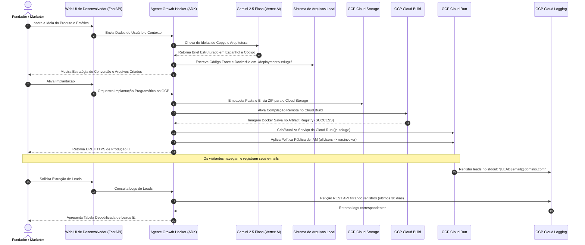

# 🚀 Agente ADK Growth Hacker: Plataforma de Landing Pages Serverless

| [🇺🇸 English](README.md) | [🇪🇸 Español](README.es.md) | 🇧🇷 **Português (Brasil)** |
| :---: | :---: | :---: |

Bem-vindo à **Plataforma do Agente Growth Hacker de ADK**! Este é um sistema agentico autônomo e avançado construído sobre o **Kit de Desenvolvimento de Agentes do Google (ADK)**. Ele foi projetado para ajudar fundadores, profissionais de marketing e desenvolvedores a validar instantaneamente novas ideias de produtos, gerando landing pages de pré-lançamento premium, conteinerizando-as e implantando-as de maneira serverless no **Google Cloud Run** em minutos.

Por meio da interação em linguagem natural, o agente elabora estratégias de ganchos de redação, estabelece guias de aquisição e automatiza todas as tarefas de engenharia no Google Cloud, incluindo armazenamento temporário no Cloud Storage, compilação no Cloud Build, provisionamento no Cloud Run, exposição pública do IAM e extração de leads em tempo real do Cloud Logging.

---

## 📐 Arquitetura e Fluxo do Sistema

A plataforma utiliza uma arquitetura híbrida local e em nuvem. A seguir, apresentamos a arquitetura de alto nível e o fluxo de trabalho estruturado:




---

## ✨ Recursos Principais

- **Estratégia de Conversão Briefing:** Gera briefs estruturados com ganchos persuasivos na seção Hero, guias de cópia alinhadas com AIDA, playbooks de aquisição orgânica e métricas de KPIs.
- **Design UI/UX Premium:** Modelos HTML/CSS/JS totalmente responsivos para dispositivos móveis, utilizando paletas de cores modernas, efeitos de brilho, tipografia do Google Fonts e micro-animações.
- **Servidor Backend FastAPI Completo:** Cada landing page gerada inclui:
  - Controladores AJAX para envios assíncronos.
  - Limitador de taxa por IP do cliente (máximo de 5 envios por minuto) para evitar spam.
  - Registros limpos no `stdout` formatados como `[LEAD] email@dominio.com` para ingestão em nuvem.
- **Implantação sem Fricção na Nuvem:** Utiliza as bibliotecas REST do GCP para subir, construir e implantar sem a necessidade de ter instalado localmente o Docker ou a CLI do gcloud.
- **Extração Serverless de Leads:** Dispensa bancos de dados tradicionais consultando diretamente a API do **Cloud Logging** por meio de paginação, filtragem e expressões regulares.

---

## 🗂️ Estrutura do Repositório

```bash
adk_landing/
├── .adk/                        # Contexto de configuração do Google ADK
├── .venv/                       # Ambiente virtual Python local
├── deployments/                 # Cache local dos projetos gerados
│   └── <slug>/                  # Projeto individual gerado
│       ├── static/              
│       │   ├── index.html       # Landing page estática indexada
│       │   ├── style.css        # Folha de estilos premium personalizada
│       │   └── script.js        # Lógica frontend do formulário de leads
│       ├── main.py              # Servidor FastAPI com limitador de taxa
│       ├── requirements.txt     # Dependências do microsserviço
│       └── Dockerfile           # Contêiner Docker leve
├── growth_hacker_agent/         # Lógica do Agente de Growth Hacking
│   ├── __init__.py
│   └── agent.py                 # Classe de Agente ADK, ferramentas e prompts do sistema
├── main.py                      # Servidor local do FastAPI e painel web de controle
├── requirements.txt             # Dependências do ambiente global
└── sessions.db                  # Banco de dados SQLite para históricos de chat
```

---

## 🚀 Guia de Início Rápido

### 1. Pré-requisitos e Autenticação no GCP

O aplicativo resolve as credenciais na seguinte ordem: variáveis de ambiente -> Servidor de Metadatos do GCP -> tokens OAuth locais.

Antes de iniciar, certifique-se de ter:
- Um projeto do Google Cloud ativo.
- A ferramenta [gcloud CLI](https://cloud.google.com/sdk/gcloud) instalada.

Autentique seu terminal local usando **Application Default Credentials (ADC)**:
```bash
# Faça login com sua conta do Google
gcloud auth login

# Configure seu projeto padrão
gcloud config set project SEU_ID_PROJETO_GCP

# Gere as credenciais padrão do aplicativo
gcloud auth application-default login
```

### 2. Configuração do Ambiente

Clone o repositório, crie seu ambiente virtual e instale as bibliotecas necessárias:
```bash
# Acesse o diretório raiz
cd adk_landing/

# Crie e ative o ambiente virtual
python3 -m venv .venv
source .venv/bin/activate

# Instale as dependências
pip install -r requirements.txt
```

### 3. Execução da Interface Web

Inicie o servidor FastAPI de desenvolvimento local:
```bash
python main.py
```
O servidor iniciará na porta `8080`. Abra seu navegador e acesse:
👉 **`http://localhost:8080/`**

---

## 🛠️ Fluxo de Trabalho de Exemplo com o Agente

O agente está configurado com instruções estritas para gerar redações e materiais publicitários exclusivamente em espanhol, garantindo o foco no mercado hispanofone.

### Fase 1: Design do Projeto
1. **Inicie a conversa:** Escreva algo como:
   > *"Olá! Quero validar uma ideia de negócio de uma garrafa térmica inteligente chamada 'SmartBrew Kettle'."*
2. **Forneça os detalhes:** O agente perguntará sobre recursos, público-alvo e o tema visual desejado (ex: *Modo escuro Glassmorphic com detalhes em verde neon*).
3. **Geração de arquivos:** O agente chama automaticamente a ferramenta `write_landing_page_files` e os armazena em `./deployments/smartbrew-kettle/`.

### Fase 2: Implantação Serverless
1. **Autorize o Agente:** Quando ele perguntar se deseja implantar ao vivo, diga:
   > *"Sim, implante o projeto."*
2. **Implantação:** O agente envia o pacote, compila a imagem Docker no Cloud Build, implanta no Cloud Run e configura políticas públicas do IAM para fornecer sua URL ativa:
   > **`https://lp-smartbrew-kettle-xxxxxx.run.app`**

### Fase 3: Consulta de Leads
Para extrair os e-mails coletados em sua lista de espera:
1. Escreva para o agente:
   > *"Mostre os e-mails cadastrados para smartbrew-kettle"*
2. O agente consulta o Cloud Logging via API e apresenta a lista formatada de e-mails.

---

## 🔐 Permissões e Roles de IAM no GCP

Sua conta ativa ou conta de serviço do GCP exige as seguintes permissões para executar as tarefas da plataforma:

| Serviço | Role do IAM Necessária | Objetivo |
| :--- | :--- | :--- |
| **Google Cloud Storage** | `roles/storage.objectAdmin` | Fazer upload de pacotes de código ZIP para os buckets de armazenamento. |
| **Cloud Build** | `roles/cloudbuild.builds.editor` | Executar compilações de imagens e enviá-las para o Artifact Registry. |
| **Cloud Run** | `roles/run.admin` | Criar, corrigir e configurar serviços do Cloud Run. |
| **Contas de Serviço** | `roles/iam.serviceAccountUser` | Executar o contêiner sob o contexto padrão do Compute Engine. |
| **Cloud Logging** | `roles/logging.viewer` | Consultar logs em tempo real para capturar leads (`[LEAD] ...`). |
| **Project IAM / Run Policy** | `roles/run.developer` ou `roles/resourcemanager.projectIamAdmin` | Aplicar políticas de acesso público não autenticado (`allUsers`). |
