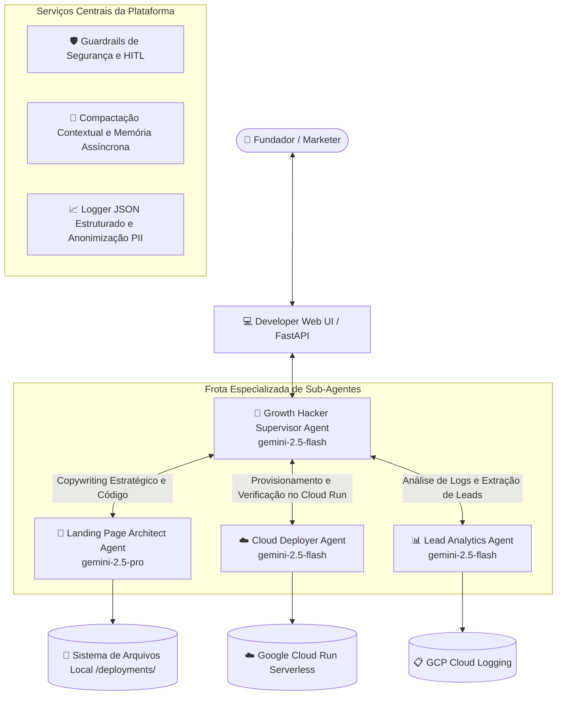

# 🚀 ADK Growth Hacker Agent: Plataforma Multi-Agente Serverless para Landing Pages

| [🇺🇸 English](README.md) | [🇪🇸 Español](README.es.md) | 🇧🇷 **Português (Brasil)** |
| :---: | :---: | :---: |

Bem-vindo à plataforma **ADK Growth Hacker Agent**! Um sistema multi-agente autônomo de nível empresarial construído sobre o **Google Agent Development Kit (ADK)**. Projetado para ajudar fundadores de startups, profissionais de marketing e desenvolvedores a validar ideias de produtos instantaneamente criando landing pages de pré-lançamento de altíssima conversão e realizando o deploy serverless no **Google Cloud Run** em minutos.

O sistema orquestra uma frota especializada de sub-agentes com roteamento inteligente de modelos (**Gemini 2.5 Pro** para síntese criativa de código e **Gemini 2.5 Flash** para operações rápidas), guardrails de segurança, compactação de memória contextual, observabilidade JSON estruturada e **Infraestrutura como Código (IaC) com Terraform**.

---

## 📐 Arquitetura Multi-Agente e Fluxo do Sistema

A plataforma utiliza o padrão **Supervisor-Trabalhador Multi-Agente** com rastreabilidade distribuída:



---

## 🚀 Início Rápido

```bash
# Ativar ambiente virtual e instalar dependências
source .venv/bin/activate
pip install -r requirements.txt

# Executar a suíte de testes e o harness de avaliação do Golden Dataset
python -m unittest discover tests
python -m eval.eval_harness

# Iniciar a interface web do desenvolvedor
python main.py
```
Acesse no seu navegador em **`http://localhost:8080/`**.
